1)
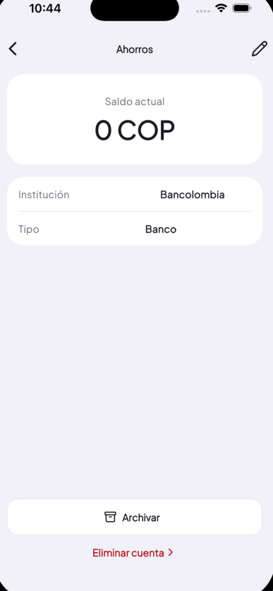

- Eliminar cuenta no tiene el icono correcto, revisar pencil
- Institución, tipo y demás datos de la tabla deben ir alineados

2) 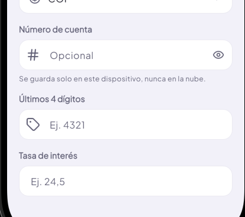
- Últimos 4 digitos solo es relevnte en tarjeta de credito y tasa de interés no es relevante en otras cuentas de banco, efectivo

3) 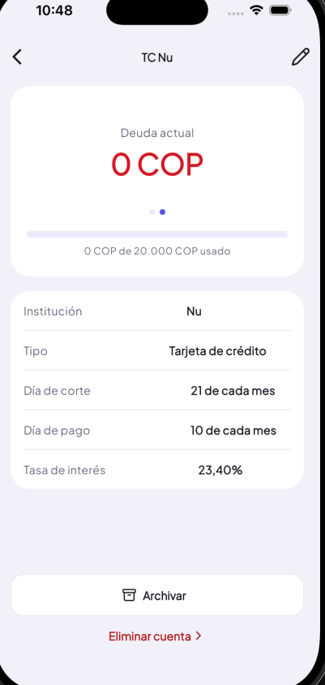
- El error 1 se propaga en las demás pantalals donde se use este patrón

4) 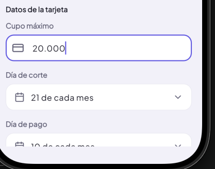
- Luego de guardar una tarjeta de crédito, cuando entro a editar, se le agrega un "." al valor y es complicado editar, esto no debería pasar. Únicamente se debería formatear el texto a moneda, no agregar puntos fijos.
- Si guardo una tarjeta de crédito con un saldo inicial de 100,000 y un cupo máximo de 200,000, por qué me aparece que tengo un cupo disponible de 300,000 y la deuda actual en 0? Revisa porque parece ser que están mal los calculos.

5) 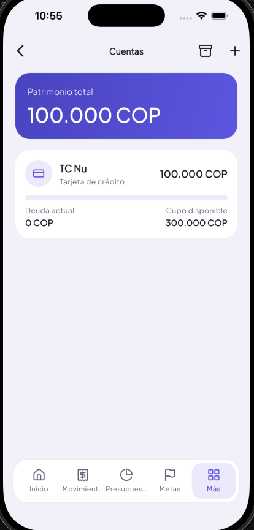
- Se deberían sumar las tarjetas de crédito al patrimonio total?

6) 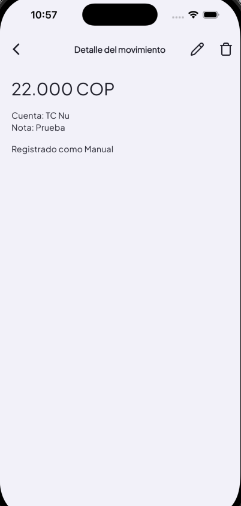
- El diseño del detalle del movimiento no corresponde con el diseño de Pencil Node ID: Of2sW.

7) 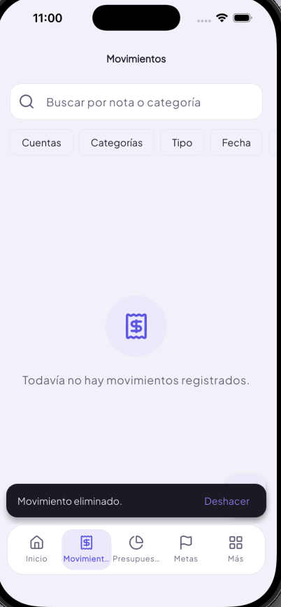
Los snackbars de la app nunca desaparecen a menos que el usuario arraste hacia abajo, eso está mal.

8) Agrega una validación para obligar al usuario a crear una cuenta antes de registrar un gasto o eso se hará en el onboarding?

9) 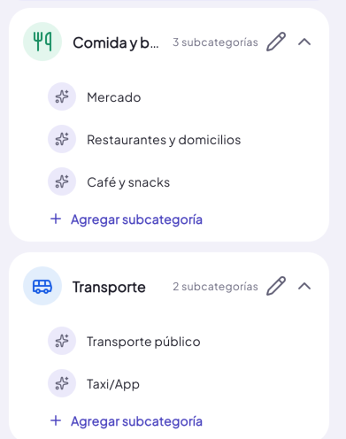
- Se cortan el nombre de algunas categorías, qué tal si quitas el texcto "Sub categorías"? 
- Las sub categorías también deben nacer con un icono pero obligatoriamente deben tener el color del padre sin opción a cambiar el color. Vale la pena expandir la cantidad de iconos que se usan en la app.

10) 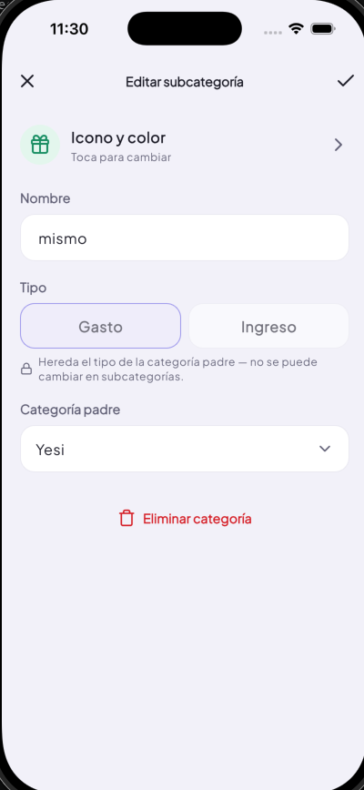
- Debería decir "Eliminar subcategoría"
- 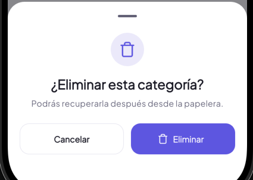 si va a existir una papelera?

11) La categoría debe ser obligatoria en los gatos al igual que la cuenta, debe aparecer un msg de error cuando no se elija alguna de estas.

- Por defecto se debe seleccionar la primera cuenta de la lista del usuario, recuerda que se puede cambiar el orden de las cuentas, entonces siempre será la que esté de primera 

12) 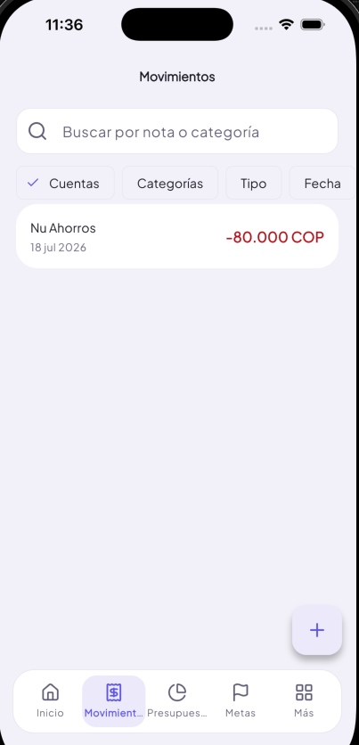
- El diseño no corresponde con el de Pencil
- 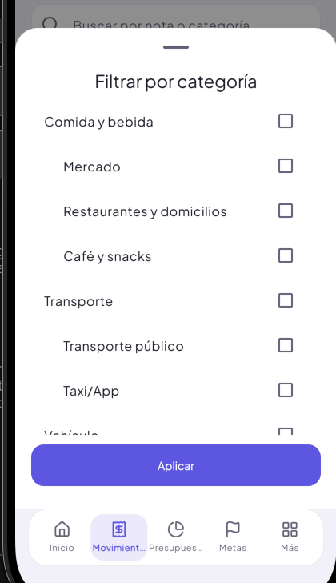 el diseño de los fltros de categorías, tipo, etiqueta y fecha tampoco. Y deben aparecer por encima del bottom bar, es decir, que no se vea el bottom nav bar. Aplica para todos los bottom sheets de la app
- 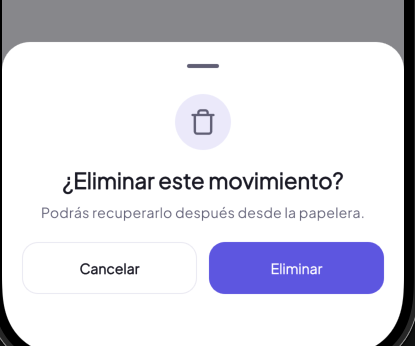 Los modeales de eliminar de todas las features de la app no correesponden con este diseño Node ID: o9116/qsjbj