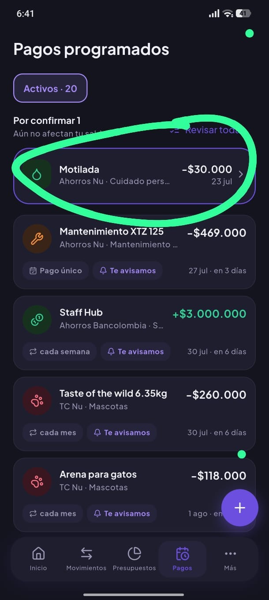
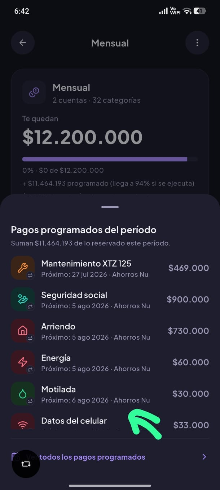
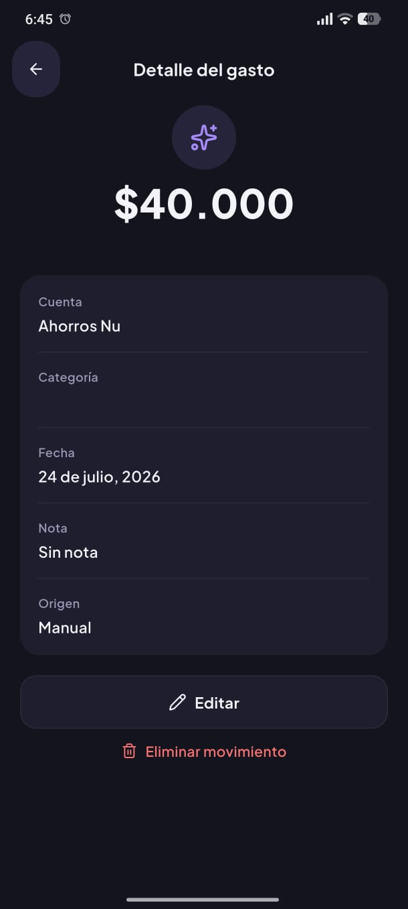
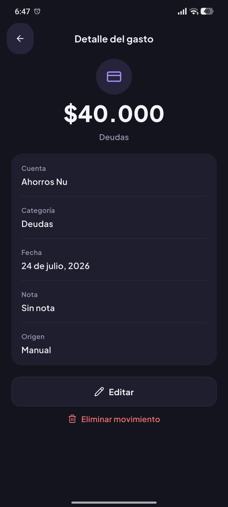
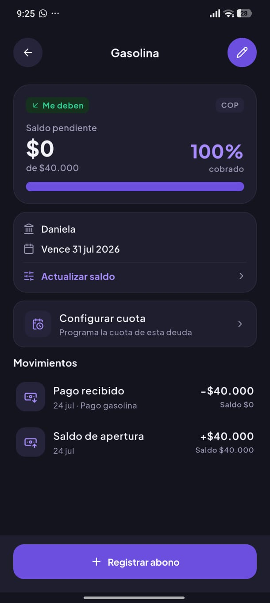
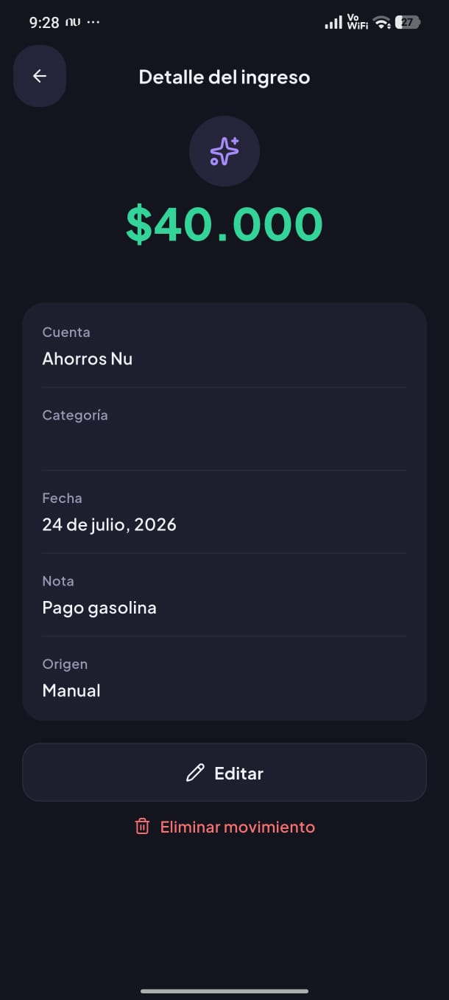
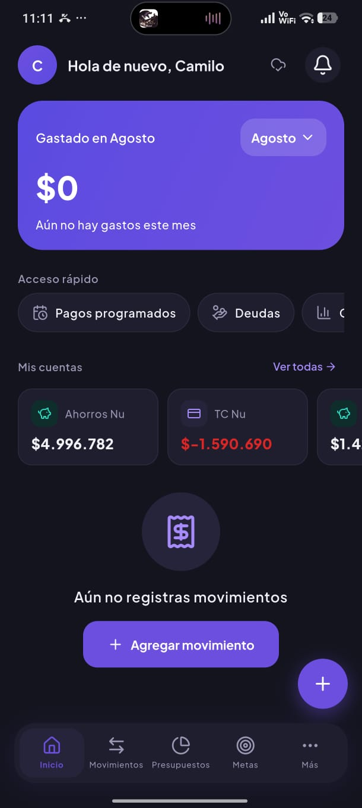
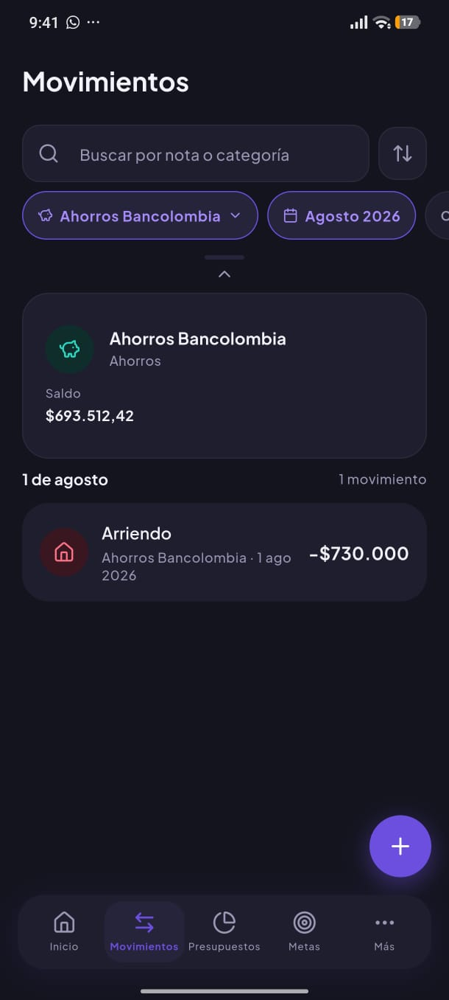

1)   No se muestra la fecha correcta cuando el pago venció y aún no se ha confirmado 

2)  Al crear una deuda y elegir que sí quiero crear un registro me crea este registro acá debería tener categorías préstamos o deudas y una nota relacionada con la deuda que se creó

3)  En el detalle de un registro que pertenece a una deuda debería decir en alguna parte o indicarle al usuario de que ese registro está enlazado con una deuda

4)  No tengo ninguna opción para Cerrar la deuda o finalizarla. Además, al llegar al 100% o superior, se debe mostrar un sheet felicitando al usuario o algo cálido y dandole la opción de cerrar/completar/archivar (no recuerdo cuál sería el termino correcto), por ende, necesitaríamops un historial para ver las deudas pasadas. Hay que tener la opción de completar y perdonar, algo así se me ocurre, te lo dejo para que analices cuál es la mejor opcion.

5)  Yo creé un abono a la deuda enlazado a una cuenta y le puse la categoría pero en el detalle no se ve reflejada la categoría

6)  Overflow error aprobando un pago programado

7)  Al cambiar de mes me filtra por los movimientos de agosto, siento que se me perdieron los datos porque el home no muestra nada, o se cambia el mensaje o se cambia la funcionalidad. Sería mejor poder filtrar por periodo de un presupuesto que por meses, el usuario lo puede elegir a su gusto

8) Si yo presto 10000 y luego me pagan esos 10000, es decir, tengo un gasto de 10000 y luego un ingreso por el mismo valor, mi presupuesto disponible solo baja, nunca aumenta. Deberían haber ciertos tipos de ingresos que sumen también al presupuesto disponible. Por ejemplo el salario NO debería sumar, pero el pago de deudas u otros ingresos si deberían, ya es cuestión de analizar cuales si o cuales no deberían sumar.

8)  El expandir y colapsar del card de cuentas en movimientos debería tener la misma posición, cuando está abierto se muestra arriba pero cuando se colapsa se muestra abajo

9) Sería bueno agregar un chip para filtrar por periodo de un presupuesto

10) Agregar autocompletado a la nota de un registro. se deben autocompletar TODOS los campos de "Notas" para que haga un autocompletado con opciones, se debe filtrar por todas las notas que el usuario haya agregado. Debe ser 1 solo field compartido a lo largo de la app.

11) Al filtrar por ingresos debería reemplazar el badge de "1 movimiento" por el total de ingresos. Analiza cuando se debe mostrar este balance/ingresos.